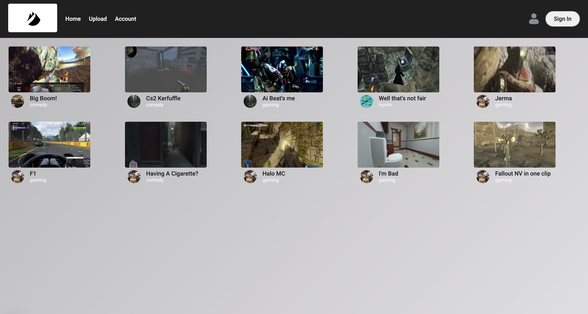
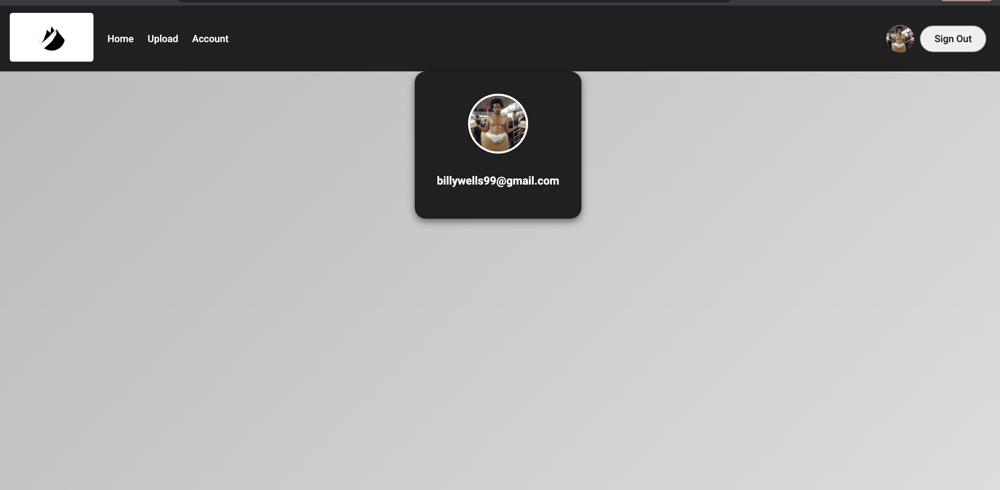
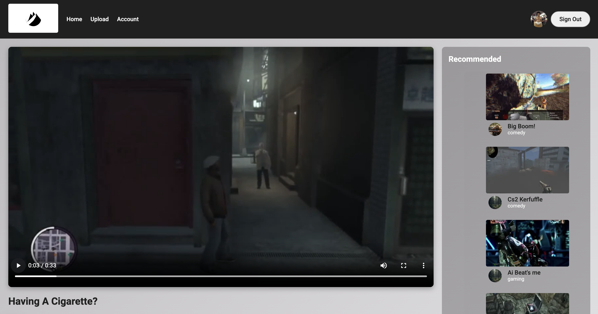
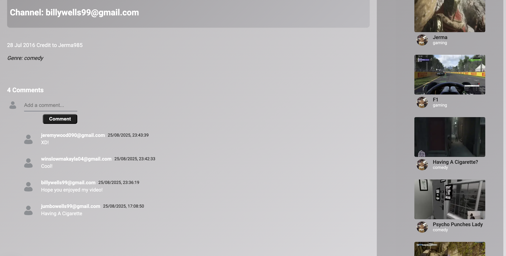
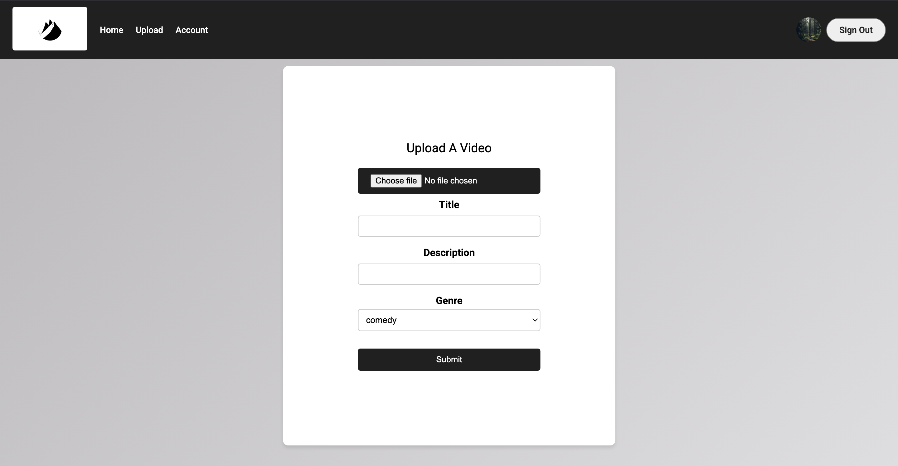

# 📺 Watch Point – A Full Stack App / Youtube Clone

This project is a full stack app utilising Google Cloud Services. Users are allowed to sign up, upload videos, delete videos, comment and view other users videos.

🔗 [Live Prototype Website (Figma)](todo)  
🔗 [Live Site](todo)

---

## 📚 Table of Contents

- [Features](#-features)
- [Showcase](#-showcase)
- [Tech Stack](#-tech-stack)
- [Project Structure](#-project-structure)
- [Disclaimer](#-disclaimer)
- [Credits](#-credits)

---

## ✨ Features

- Modern, mobile-friendly UI for video browsing and playback
- Video upload flow with metadata (title, description, genre) and thumbnail generation
- Fully working video processing pipeline (raw upload → Pub/Sub → Cloud Run → processed video + thumbnail → Buckets & Firestore)
- Persistent user state and authentication via Firebase (Google Sign-In)
- Comment system with real-time updates

---

## 🖼 Showcase

Each of the following pages was designed for usability, layout clarity, and mobile responsiveness.

### 🏠 Home Page

| HomePage                |
| ----------------------- |
|  |

---

### 👤 Account Page

| Account Page                   |
| ------------------------------ |
|  |

---

### 📺 Watch Page

| Watch Page                     |
| ------------------------------ |
|  |

---

### 💬 Comments Section

| Comments Section                    |
| ----------------------------------- |
|  |

---

### ⬆️ Upload Page

| Upload Page                  |
| ---------------------------- |
|  |

---

## 🛠 Tech Stack

- **HTML5** – Semantic structure
- **CSS3** – Responsive layouts with reusable, modular styles
- **TypeScript** – Component logic, type safety, and dynamic functionality
- **JSON** – Data handling and API communication
- **Next.js** – Frontend framework for server-side rendering and client-side routing
- **Firebase**:
  - **Authentication** – Google Sign-In for user accounts
  - **Firestore** – Cloud-hosted NoSQL database for storing videos, metadata, comments, and user data
  - **Cloud Functions** – Serverless backend logic (HTTP & callable functions)
- **Google Cloud Storage** – Buckets for raw videos, processed videos, and thumbnails
- **Google Cloud Pub/Sub** – Event-driven video processing workflow for processing and generating thumbnails asynchronously
- **FFmpeg** – Video and thumbnail processing utility for encoding, resizing, and generating preview images
- **Google Cloud Run** – Serverless hosting and deployment for the video-processing microservice

---

## 📁 Project Structure

```
WatchPoint/
├── documentation/
│   ├── pages/              
│   └── files/            
│
├── yt-web-client/
│   ├── src/
│   │   ├── page.tsx       # Homepage
│   │   ├── layout.tsx      # Root layout applying global css, wrapping all pages with Navbar and {children}
│   │   ├── account/
│   │   │   ├── page.tsx
│   │   │   ├── account.module.css
│   │   ├── components/
│   │   │   ├── comments.tsx    # handles comment section, fetching and storing comments
│   │   │   ├── comments.css
│   │   │   ├── videoCard.tsx   # handles and displays meta data on the videocards since in homepage and recommended side bar
│   │   │   ├── videoCard.module.css
│   │   ├── firebase/
│   │   │   ├── firebase.ts     # frontend firebase authentication setup
│   │   │   ├── functions.ts    # client-side bridge to firebase functions, handling uploads, user/video metadata & comments
│   │   ├── navbar/
│   │   │   ├── navbar.tsx
│   │   │   ├── sign-in.tsx     # allows user to sign in/out
│   │   ├── upload/
│   │   │   ├── page.tsx
│   │   │   ├── components/
│   │   │   │   ├── CustomDropDown.tsx
│   │   │   │   ├── CustomTextField.tsx
│   │   │   │   ├── Form.tsx
│   │   │   │   ├── form.module.css
│   │   ├── watch/
│   │   │   ├── page.tsx
│   │   │   ├── sideBarRecommended.tsx
│   │   │   ├── uploader.tsx
│   │   │   ├── uploader.module.css
│   │   │   ├── watch.module.css
│
├── yt-api-service/
│   ├── firebase.json
│   ├── functions/
│   │   ├── src/
│   │   │   ├── index.ts  # Firebase cloud functions backend, handling Server Side Logic using HTTP callable functions
│            
├── video-processing-service/
│   ├── src/
│   │   ├── firestore.ts   # firestore crud helper module for managing video data
│   │   ├── index.ts       # main server file
│   │   ├── storage.ts     # video, thumbanil processing utility, handling downloading, processing, uploading, cleanup
│   │   ├── thumbnailGeneration.ts   # focused utility for generating thumbanils from videos using ffmpeg
│   ├── raw-videos/
│   ├── processed-videos/   # these 3 folders are all for local testing
│   ├── thumbnails/ 
│          
└── README.md

```

---

## ⚠️ Disclaimer

This project is a personal project created for learning purposes.
Youtube's original branding and content belong to their respective owners.
All videos and content belong to their respective owners.
I am not affiliated with Youtube — this is a non-commercial project for learning.

---

## 🌟 Credits

- **Design & Development:** William Wells
